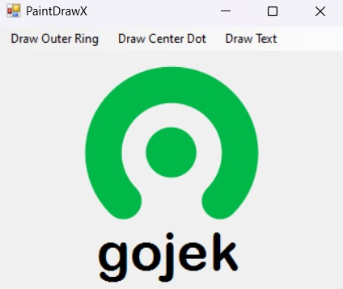

# PaintDrawX

PaintDrawX is a simple Windows Forms application written in C# that demonstrates step-by-step drawing of the Gojek logo. The application allows users to progressively draw the logo by selecting menu options.

## Features
- Draw the Gojek logo in three steps:
  1. Draw the outer green arc (ring)
  2. Draw the center green dot
  3. Draw the text "gojek" below the logo
- Responsive UI: The logo is always centered and scales with the window size
- Clean, anti-aliased graphics

## How It Works
- The main form (`Form1`) contains a menu strip with three options:
  - **Draw Outer Ring**: Draws the outer arc of the logo
  - **Draw Center Dot**: Draws the center dot (enabled after the ring)
  - **Draw Text**: Draws the "gojek" text (enabled after the dot)
- Each menu item triggers a drawing step, and the form is redrawn accordingly.

## Getting Started

### Prerequisites
- Windows OS
- [.NET Framework 3.5](https://www.microsoft.com/en-us/download/details.aspx?id=21) or later
- Visual Studio (recommended for building and running)

### Building and Running
1. Clone or download this repository.
2. Open `PaintDrawX.sln` in Visual Studio.
3. Build the solution (`Build > Build Solution`).
4. Run the application (`Debug > Start Debugging` or press `F5`).

## File Structure
- `Form1.cs` - Main form logic and drawing code
- `Form1.Designer.cs` - UI layout and menu setup (auto-generated)
- `Form1.resx` - Resources for the form
- `Program.cs` - Application entry point
- `Properties/` - Assembly info, resources, and settings
- `PaintDrawX.csproj` - Project file

## Screenshots

*Example of the Gojek logo drawn by PaintDrawX*

## License
This project is for educational and demonstration purposes. No license specified. 